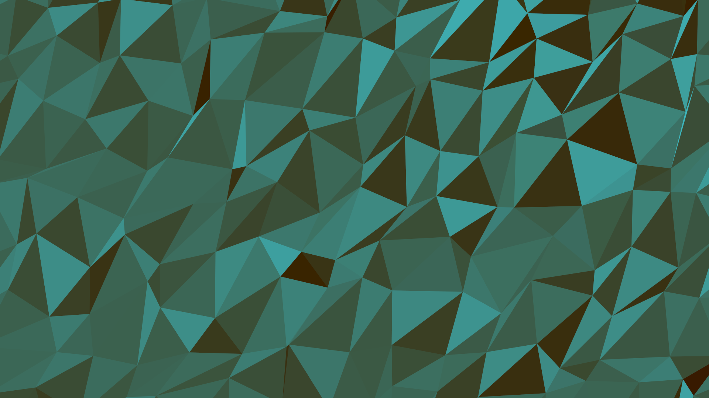

# polypaper-rs

A Rust implementation of my previous project [polypaper](https://github.com/ramonimbao/polypaper), a low-poly wallpaper generator. Uses the [quicksilver](https://github.com/ryanisaacg/quicksilver) 2D game framework for creating images.

## Samples

## Usage

Run the program with `cargo run --release`.

Press `SPACE` to generate a new random mesh. Press `ENTER` to save this mesh. You'll just have to wait for a new mesh to appear to know that you've saved the file.

## To Do

- Implement the CLI aspect of it, or
- Make it more interactive somewhat

## License

This project is licensed under the MIT license - see the [LICENSE.md](LICENSE.md) for details.
